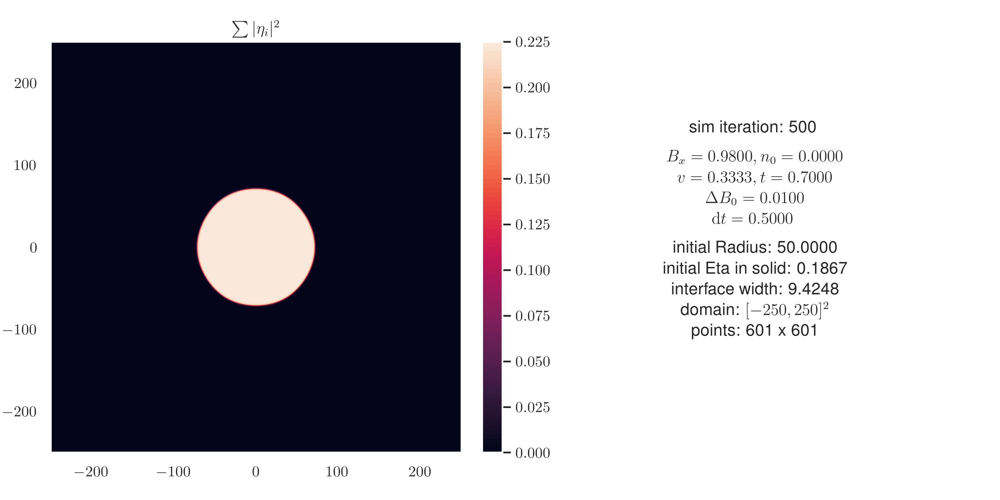
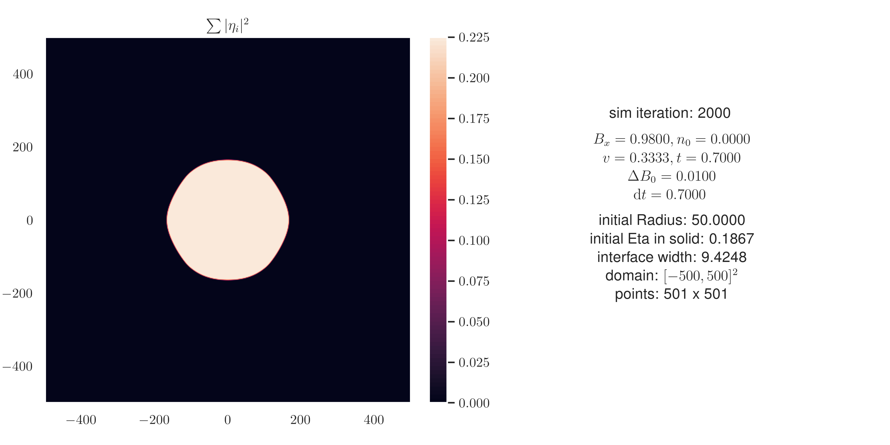
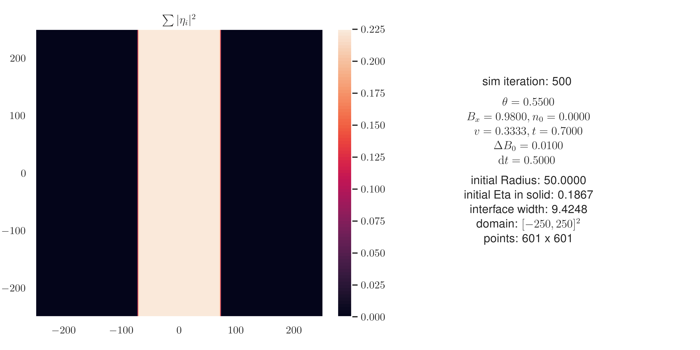
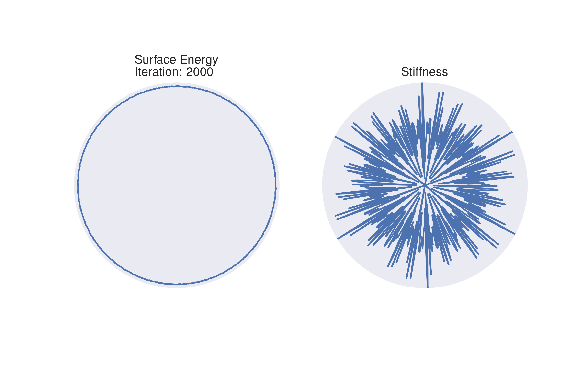
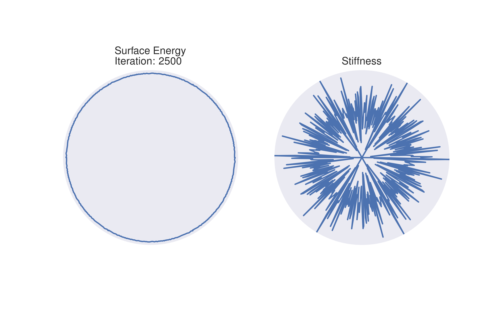

# 2023-01-16

## Grain Sim

I fixed the issue where I had this {ref}`repeating pattern <2023-01-04_update#sim-3>`
in the amplitudes. In the end it was a problem with the way I plotted the amplitudes.
The simulation itself was fine.

Here an example of how it looks:

But the corners don't really get "sharp".

## Line Sim

I also got the "line" simulation working.

I did this simulation for 100 angles between $0$ and $2 \pi / 6$.
But I can't really get any good looking stiffness plots.
There is always way too much noise.

I also tried the exact same procedure with the grain simulation. I rotated the
$\boldsymbol{G}_m$ vectors, and then just used the positive x-Axis for the
surface energy calculation.

I think that the energy difference between the solid and liquid phase is just too small.
The amplitudes are usually on the order of $10^{-1}$ or $10^{-2}$.

Maybe using the $n_0$ parameter will fix this?
