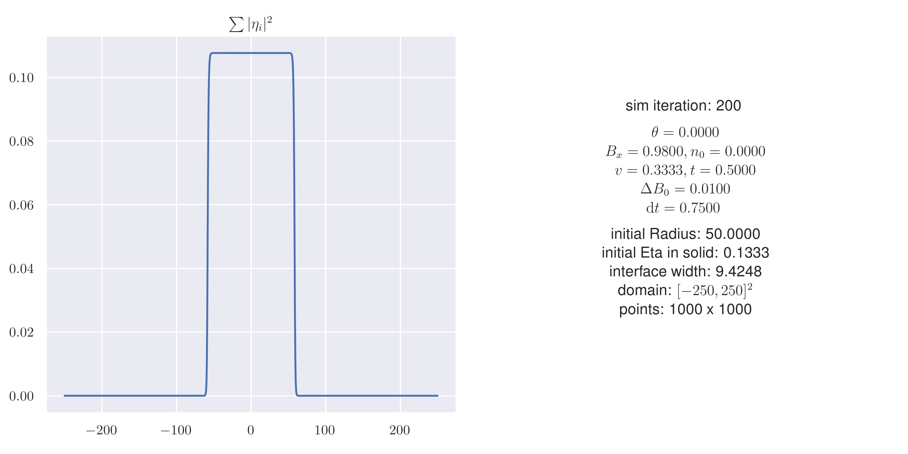
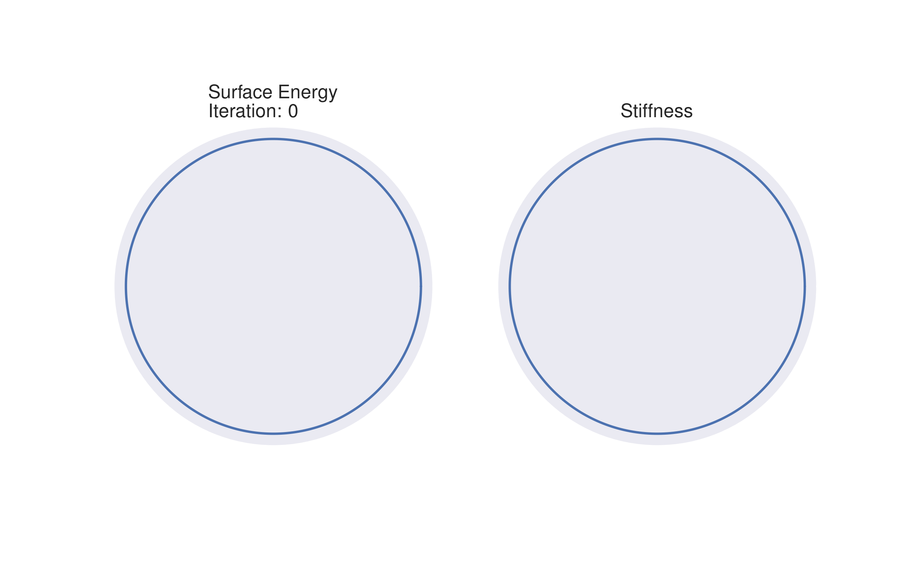
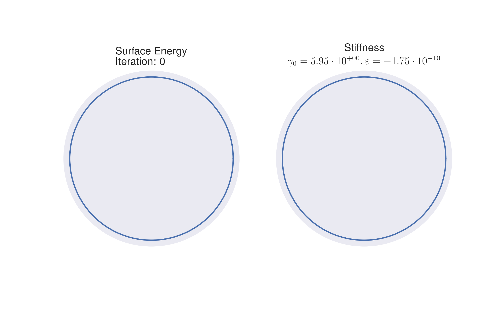

# 2023-01-24

I fixed my surface energy calculation, and implemented a 1D simulation.

## 1-Dimensional

I also did the fit to

$$
\begin{equation}
\gamma = \gamma_0 \left[
    1 + \sum\limits_{u=1}^N \varepsilon_{6u}
    \cos \left( 6 u \theta \right)
\right]
\end{equation}
$$

with $N = 1$.

