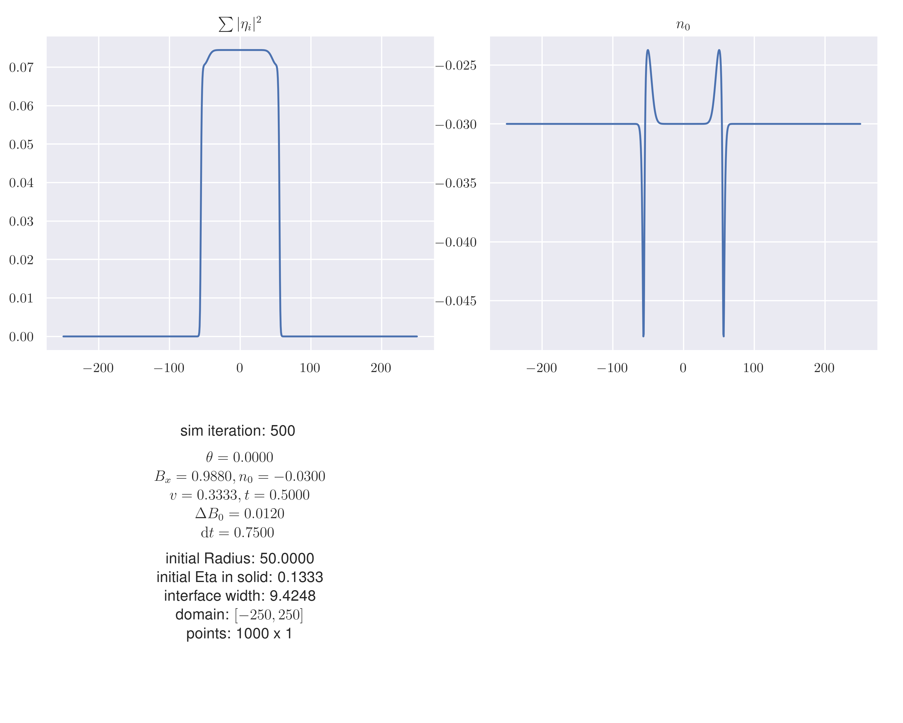
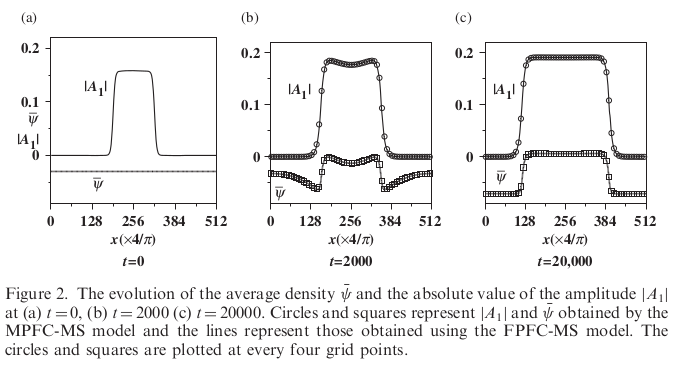
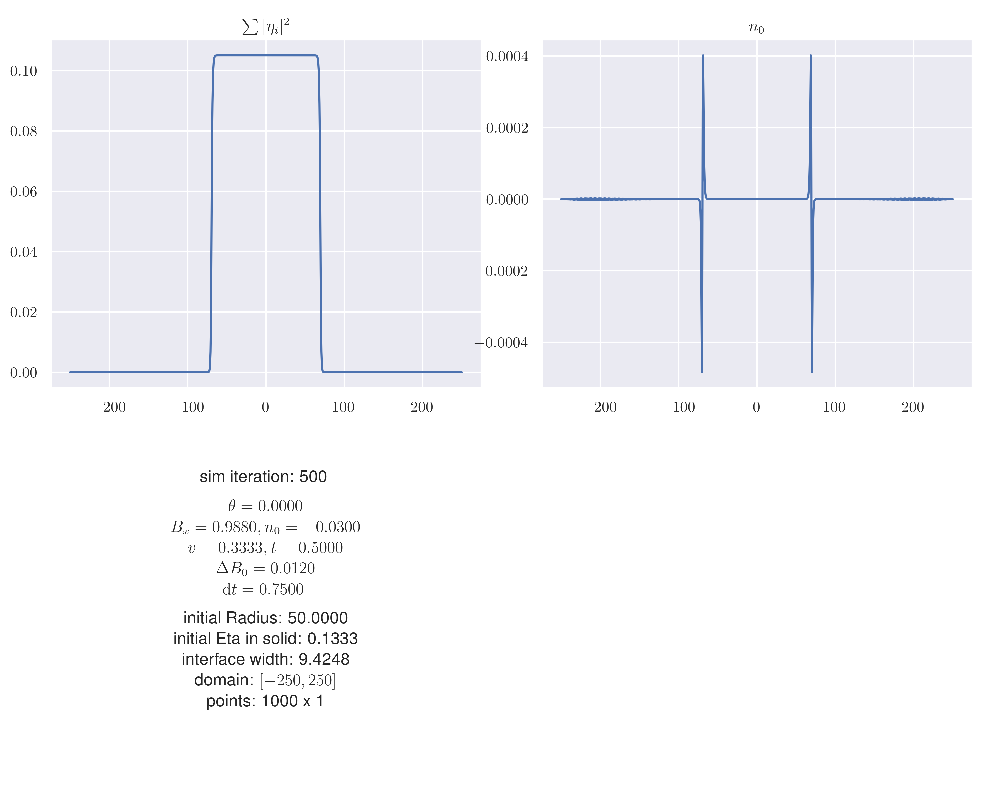

# 2023-02-20

$$
\begin{gathered}
\frac{\partial n_0}{\partial t} =
\nabla^2 \left[
    \left(
        \Delta B^0 + B^x + 3 v \Phi
    \right) n_0
    + 3 v P - \Phi t
    - t n_0^2 + v n_0^3
\right] \\
\text{with} \quad
P = 2 \left(
    \prod\limits_m \eta_m + \prod\limits_m \eta_m^*
\right)
\end{gathered}
$$

## Scheme

$$
\begin{gathered}
\frac{\partial n_0}{\partial t} = \nabla^2 \mathcal{L} n_0 + \nabla^2 N(n_0) \\
\text{with} \\
\mathcal{L} = \Delta B^0 + B^x + 3 v \Phi \\
N(n_0) = 3 v P - \Phi t - t n_0^2 + v n_0^3
\end{gathered}
$$ (eqn:update20230220n0_scheme)

With fourier and numerical scheme:

$$
\begin{gathered}
\frac{\widehat{n}_{t+1} - \widehat{n}_t}{\tau} =
\widehat{\nabla^2} \widehat{\mathcal{L}} \widehat{n}_{t+1}
+ \widehat{\nabla^2} \widehat{N}_t \\
\rightarrow \quad
\widehat{n}_{t+1} = \frac{
    \widehat{n}_t + \tau \widehat{\nabla^2} \widehat{N}_t
}{
    1 - \tau \widehat{\nabla^2} \widehat{\mathcal{L}}
}
\end{gathered} \\
\text{with} \quad
\widehat{\nabla^2} = - (k_x^2 + k_y ^2)
$$

I do one step of the $n_0$ iteration, using all the previous $\eta_m$.
Then one step of the $\eta_m$ iteration, using the new $n_0$.

## Results

I used the initial values of the {cite:t}`2010Yeon_apfc_density` paper.

However this does not match the results of the {cite:t}`2010Yeon_apfc_density`
paper at all. Here a screenshot of what it was supposed to look like:

So I started thinking maybe something is wrong with my stepping scheme.
I organized eq. {eq}`eqn:update20230220n0_scheme` into a matrix and let
a numerical solver give me my new $n_0$.

$$
\begin{gathered}
\begin{cases}
\frac{\widehat{n}_{t+1} - \widehat{n}_t}{\tau} = \widehat{\nabla^2}
\widehat{\gamma}_{t+1} \\
\widehat{\gamma}_{t+1} = \widehat{\nabla^2} \widehat{\mathcal{L}} \widehat{n}_{t+1}
\end{cases} \\
\rightarrow \quad
\begin{bmatrix}
    1 / \tau & - \widehat{\nabla^2} \\
    \widehat{\mathcal{L}} & 1
\end{bmatrix}
\begin{bmatrix}
    \widehat{n}_{t+1} \\
    \widehat{\gamma}_{t+1}
\end{bmatrix}
=
\begin{bmatrix}
    \widehat{n}_{t} / \tau \\
    \widehat{N}_{t}
\end{bmatrix}
\end{gathered}
$$

The results should be the same. But they are not. And they still don't match the
{cite:t}`2010Yeon_apfc_density` paper.

The time scale is much faster with the numerical solver. Also the two
positive peaks now move with the interface. The "base-line" density
automatically goes to $0$ after the initialization with $n_0 = -0.03$.
But regardless, there still is no difference between the solid and liquid phase.
