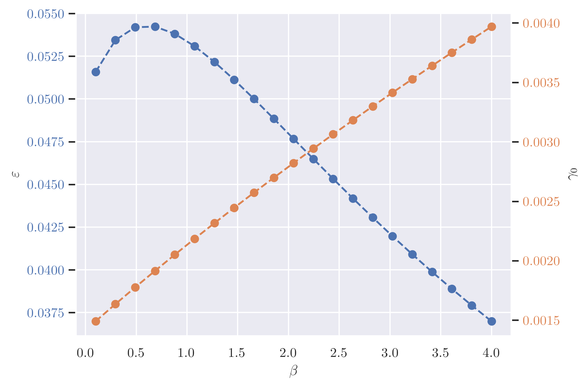
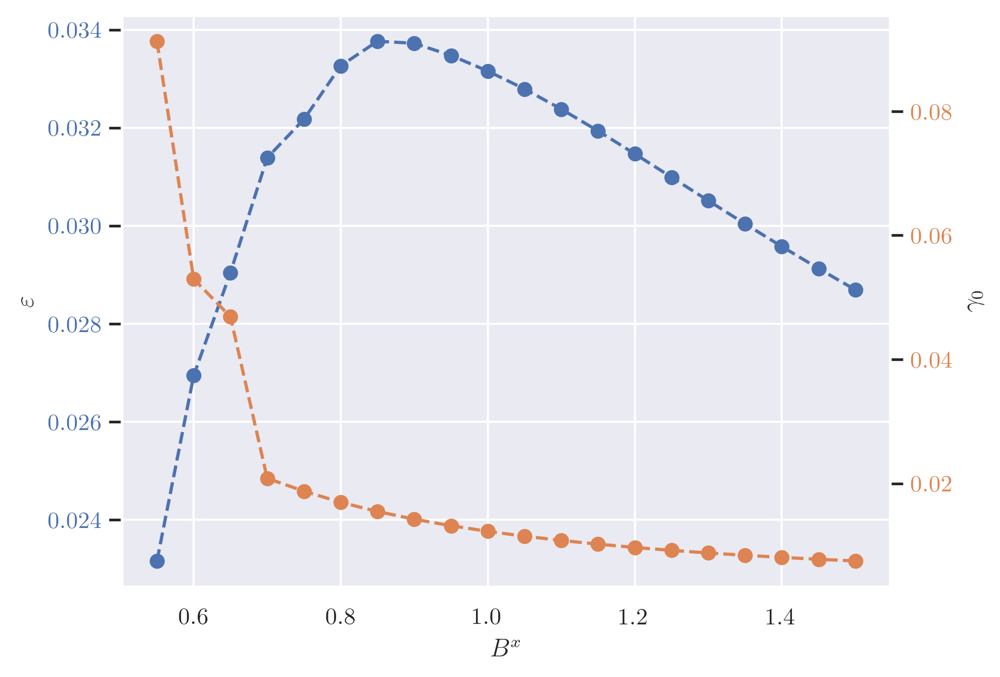
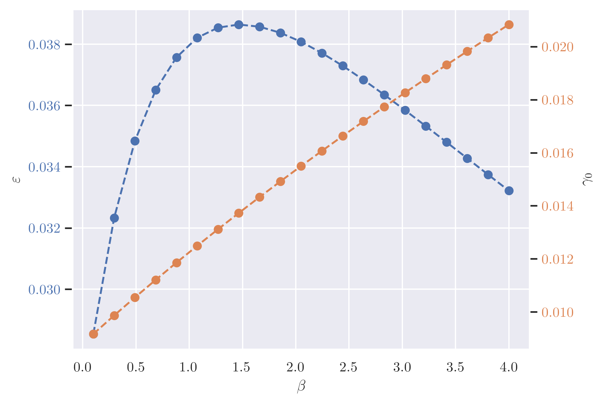
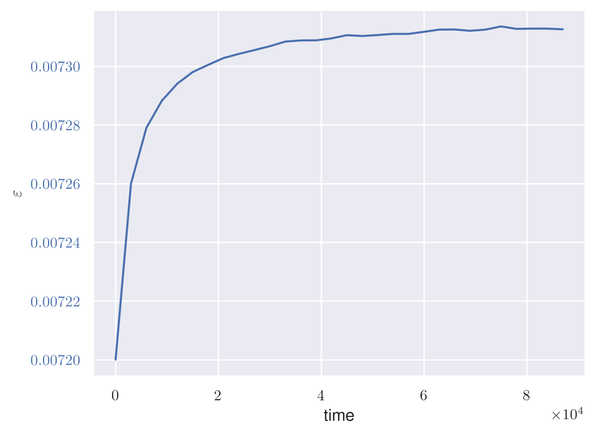

# 2023-04-17

## Param Set 1

This is the parameter set Maik used to generate his dendrite.

| $B^x$     | $\Delta B^0$ | initial $n_0$ | $\mathrm{d}t$ | t     | v     |
|-----------|--------------|---------------|---------------|-------|-------|
| $0.45981$ | $0.14019$    | $0.849$       | $5.0$         | $0.5$ | $1/3$ |

Then I varied $B^x$ and $\beta$ seperately and measured the surface energy
at equilibrium. The fit values are plotted:

For this parameter set I also did 2d simulation for 25 $\beta$ and $B^x$
combinations. The plot shows all simulations at **time** $=60000$.
It seemed to me that the grain never truly stops growing, or maybe my
domain was always to small.

I plan to create a plot where all the grains are roughly the same size in a
bigger domain to get a better comparisson for the $B^x$ values.
But the simulations take a lot of time on my machine.

## Param Set 2

This is the parameter set from the {cite:t}`2010Yeon_apfc_density` paper.

| $B^x$     | $\Delta B^0$ | initial $n_0$ | $\mathrm{d}t$ | t     | v     |
|-----------|--------------|---------------|---------------|-------|-------|
| $0.988$   | $0.012$      | $-0.03$       | $5.0$         | $0.5$ | $1/3$ |

I plan on doing a 2d simulation similar to the first parameter set.

## Surface Energy for n0 const

I chose a different definition of the chemical potential to calculate the
surface energy (See the [Surface Energy Section](ch:surf_en)).

In equilibrium or close to it, the definition also matches the results
used in the
{cite:t}`2018Ofori_anisotrop_pfc` paper for the $n_0$ simulations.

Technically, the surface energy calculation could now be used for the
simulations with $n_0 = \text{const.}$. However, because the grain
continuously grows if the solid state is favored,
the $\gamma_0$ parameter also continuously grows. $\varepsilon$ seems to
approach some stable value at least visually. If it actually converges,
$\varepsilon$ would be the only usable parameter. I would need to run
this simulation much longer on a much bigger domain to tell.

