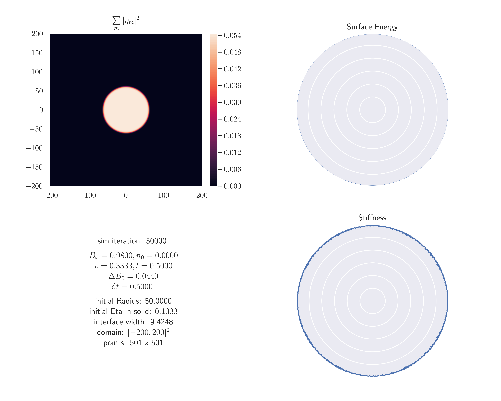
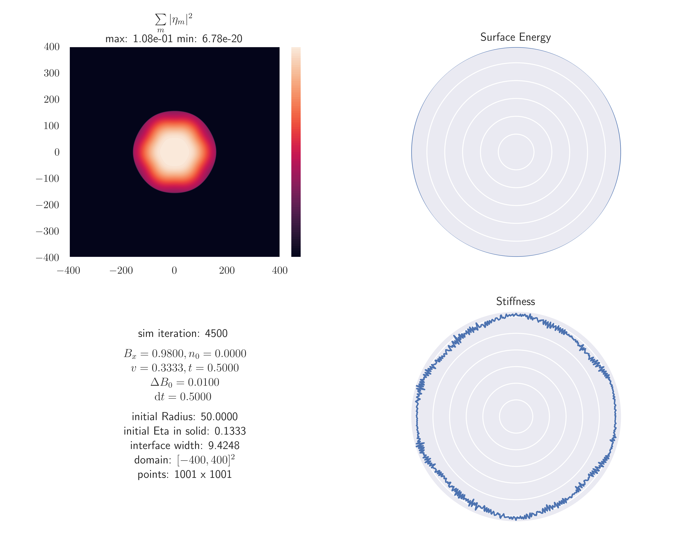
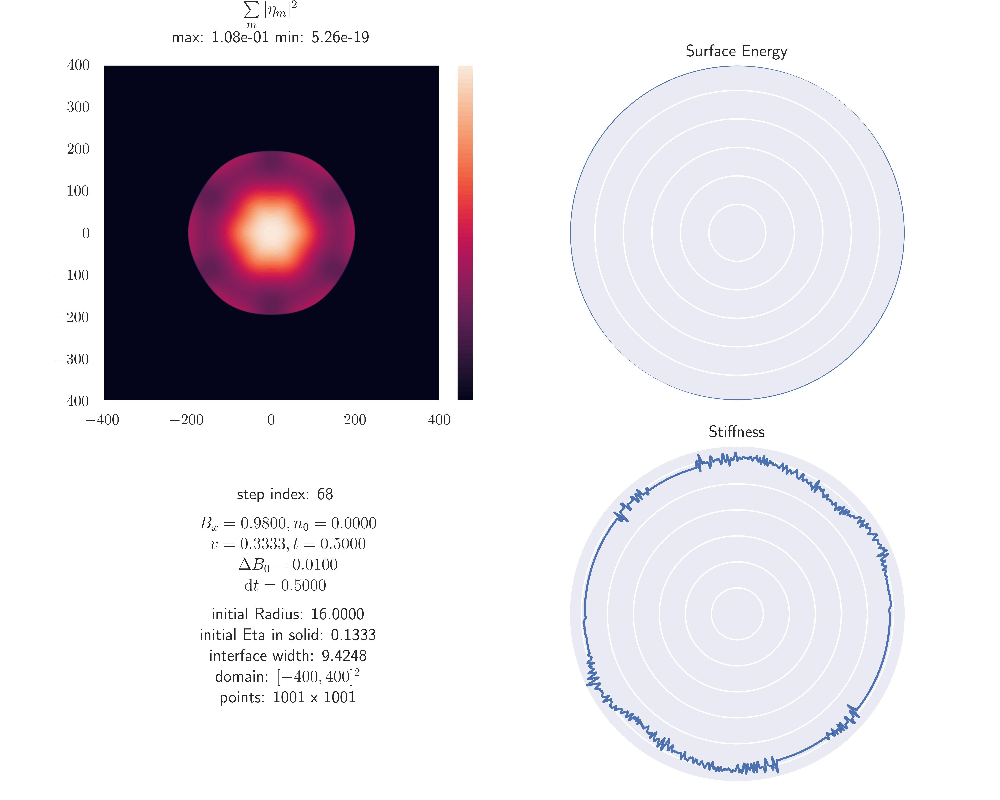
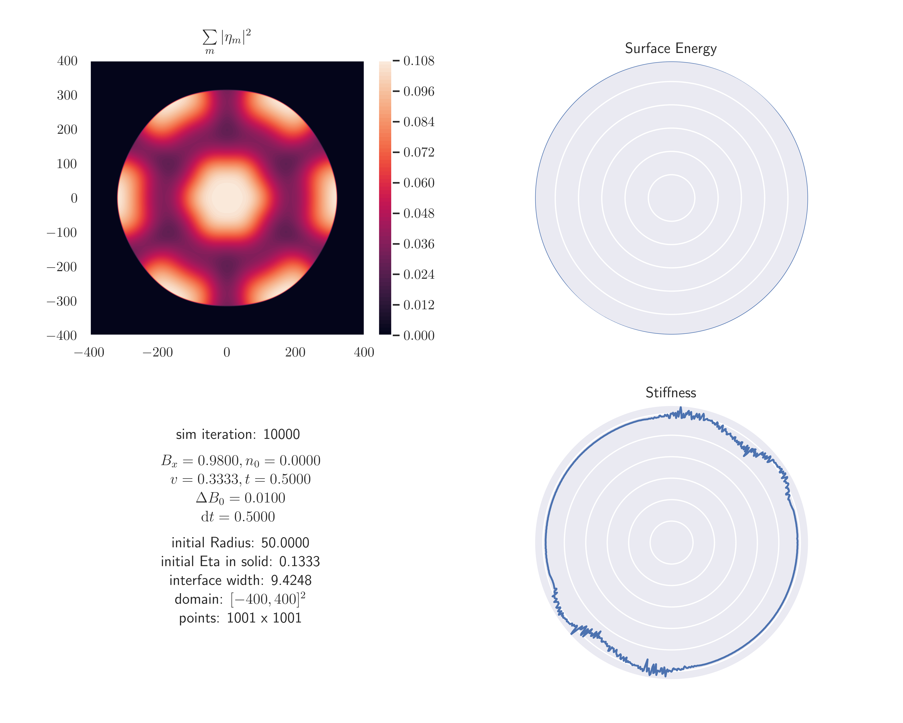

# Fourier

## Base equation

General Representation

$$
\begin{equation}
\frac{\partial \eta_m}{\partial t} \approx
- | \boldsymbol{G}_m |^2 \left[
    A \mathcal{G}_m^2 \eta_m + B \eta_m + 3 D (\Phi - |\eta_m|^2) \eta_m + \frac{\partial f^s}{\partial \eta_m^*}
\right]
\end{equation}
$$ (eqn:apfc_flow)

With

$$
\begin{aligned}
A &= B^x \\
B &= \Delta B^0 - 2 t n_0 + 3 v n_0^2 \\
C &= - (t + 3 n_0) \\
D &= v \\
\Phi &= 2 \sum\limits_m^M |\eta_m|^2 \\
\mathcal{G}_m &= \nabla^2 + 2 \mathbb{i} \boldsymbol{G}_m \nabla
\end{aligned}
$$ (eqn:apfc_flow_constants)

For a triangular crystal with one-mode approx.:

$$
\begin{gathered}
f = 2 C (\eta_1 \eta_2 \eta_3 + \eta_1^* \eta_2^* \eta_3^*) \\
\boldsymbol{G}_1 = \begin{bmatrix} - \sqrt{3} / 2 \\ - 1 / 2 \end{bmatrix}, \quad
\boldsymbol{G}_2 = \begin{bmatrix} 0 \\ 1 \end{bmatrix}, \quad
\boldsymbol{G}_3 = \begin{bmatrix} \sqrt{3} / 2 \\ - 1 / 2 \end{bmatrix}
\end{gathered}
$$ (eqn:onemodetriangluar)

## General Fourier Approach

For fourier method transform the base equation into the form

$$
\begin{equation}
\frac{\partial \eta_m}{\partial t} = \mathcal{L}_m \eta_m + N(\eta_m)
\end{equation}
$$ (eq:ode_form)

where $\mathcal{L}_m$ is a linear operator and $N(\eta_m)$ is a non-linear function of $\eta_m$.
Then fourier transform it.

$$
\begin{equation}
\frac{\partial \widehat{\eta}_k}{\partial t} = \mathcal{L}_k \widehat{\eta}_k + \widehat{N}_k
\end{equation}
$$ (eqn:ode_fourier_form)

This ODE is solved by

$$
\begin{equation}
\widehat{\eta}_k (t) = e^{\mathcal{L}_k t} \widehat{\eta}_k(0) + e^{\mathcal{L}_k t}
\int\limits_0^t \mathcal{d}t^\prime e^{- \mathcal{L}_k t^\prime} \widehat{N}_k(t^\prime)
\end{equation}
$$

under the assumption that $\mathcal{L}_k$ does not depend on time. With another approximation of
$\widehat{N}_k(t^\prime) \approx \widehat{N}_k(t)$ the equation for $\widehat{\eta}_k (t + \Delta t)$ reads

$$
\begin{equation}
\widehat{\eta}_k (t + \Delta t) =
e^{\mathcal{L}_k \Delta t} \widehat{\eta}_k(t) +
\frac{e^{\mathcal{L}_k \Delta t} - 1}{\mathcal{L}_k} \widehat{N}_k(t)
\end{equation}
$$ (eqn:fourier_approx_sol)

## Fourier Method applied to Base equation

- decouple amplitudes

The only linear Terms are $(A \mathcal{G}^2 + B)\eta_m$. Under the fourier transform $B$ stays a constant and $\mathcal{G}^2$ becomes:

$$
\begin{align}
\mathcal{G}_m &= \nabla^2 + 2 \mathbb{i} \boldsymbol{G}_m \nabla \\
\widehat{\mathcal{G}_m^2} &= \left( k_x^2 + k_y^2 + 2 G_m^{(x)} k_x + 2 G_m^{(y)} k_y \right)^2
\end{align}
$$ (eqn:g_sq_op_fourier)

Where $k_x$ and $k_y$ are the frequency variables.

All other parts of equation {eq}`eqn:apfc_flow` are kept in the non linear part $N(\eta_m)$. In each timestep $N(\eta_m)$ is computed and
then fourier transformed.

## Results

One step index corresponds to 100 simulation iterations.

### Sim 1

### Sim 2

### Sim 3

